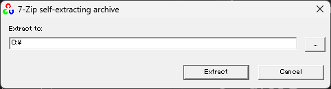

# RealSense を使ってデプスとカラーを表示する

RealSense で取得したデプスとカラーを OpenCV を使って表示するサンプルプログラムです。

```txt
Copyright (c) 2024, Kohe Tokoi
All rights reserved.

Redistribution and use in source and binary forms, with or without
modification, are permitted provided that the following conditions are met:
* Redistributions of source code must retain the above copyright notice, 
  this list of conditions and the following disclaimer.
* Redistributions in binary form must reproduce the above copyright notice, 
  this list of conditions and the following disclaimer in the documentation 
  and/or other materials provided with the distribution.
* Neither the name of the <organization> nor the names of its contributors 
  may be used to endorse or promote products derived from this software 
  without specific prior written permission.

THIS SOFTWARE IS PROVIDED BY THE COPYRIGHT HOLDERS AND CONTRIBUTORS "AS IS" AND
ANY EXPRESS OR IMPLIED WARRANTIES, INCLUDING, BUT NOT LIMITED TO, THE IMPLIED
WARRANTIES OF MERCHANTABILITY AND FITNESS FOR A PARTICULAR PURPOSE ARE
DISCLAIMED. IN NO EVENT SHALL <COPYRIGHT HOLDER> BE LIABLE FOR ANY
DIRECT, INDIRECT, INCIDENTAL, SPECIAL, EXEMPLARY, OR CONSEQUENTIAL DAMAGES
(INCLUDING, BUT NOT LIMITED TO, PROCUREMENT OF SUBSTITUTE GOODS OR SERVICES;
LOSS OF USE, DATA, OR PROFITS; OR BUSINESS INTERRUPTION) HOWEVER CAUSED AND
ON ANY THEORY OF LIABILITY, WHETHER IN CONTRACT, STRICT LIABILITY, OR TORT
(INCLUDING NEGLIGENCE OR OTHERWISE) ARISING IN ANY WAY OUT OF THE USE OF THIS
SOFTWARE, EVEN IF ADVISED OF THE POSSIBILITY OF SUCH DAMAGE.
```

## セットアップ

### OpenCV の入手

OpenCV のバイナリライブラリは [Releases - OpenCV](https://opencv.org/releases/) から入手してください。バージョンは 4.x.y を想定しています。

### OpenCV のインストール

インストーラ (`opencv-4.x.y-windows.exe`) を起動して、展開先を指定してください。このプロジェクトは C:\ に展開されているものとして設定しています。



### librealsense の入手

librealsense のインストーラは GitHub の [Releases · IntelRealSense/librealsense](https://github.com/IntelRealSense/librealsense/releases) から入手してください。`Assets` の中にある `Intel.RealSense.SDK-WIN10-2.x.y.z.exe` がインストーラです。

### librealsense のインストール

インストーラ (`Intel.RealSense.SDK-WIN10-2.x.y.z.exe`) を起動してください。そのまま進めれば、`C:\Program Files (x86)\Intel RealSense SDK 2.0` にインストールされます。

## ビルド

OpenCV のバイナリが 64bit なので、プラットフォームを `x64` にしてビルドしてください。

## 実行

実行するとデプスとカラーのウィンドウがそれぞれ開きます。どちらかのウィンドウで `ESC` キーをタイプすれば終了します。**クローズボックスをクリックしても閉じません。**
